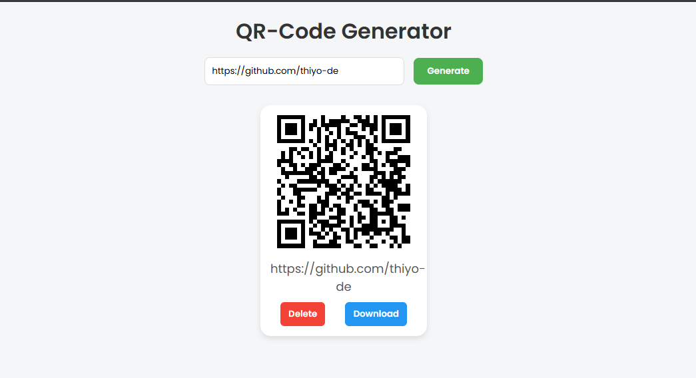

# QR Code Generator


A simple and modern QR Code Generator web application that allows users to easily create QR codes from their input text. This project is built using vanilla JavaScript, HTML, and CSS.

## 🌐 Live Demo
[Click to View the Live App](https://thiyo-de.github.io/QR-Code-Generator/)

## 📸 Screenshot


## ✨ Features
- ✅ Real-time QR code generation
- ✅ Save generated QR codes to local storage
- ✅ Display saved QR codes as stylish cards
- ✅ Download QR codes as images
- ✅ Delete QR codes individually
- ✅ Responsive and modern UI

## 🚀 How to Use
1. Enter the text or URL in the input field.
2. Click on the **Generate QR Code** button.
3. The QR code will be generated and displayed as a card.
4. Each card has:
   - **Download** button to save the QR code image.
   - **Delete** button to remove the QR code from the list and local storage.

## 💻 Installation (For Local Setup)
1. Clone the repository:
```bash
git clone https://github.com/thiyo-de/QR-Code-Generator.git
